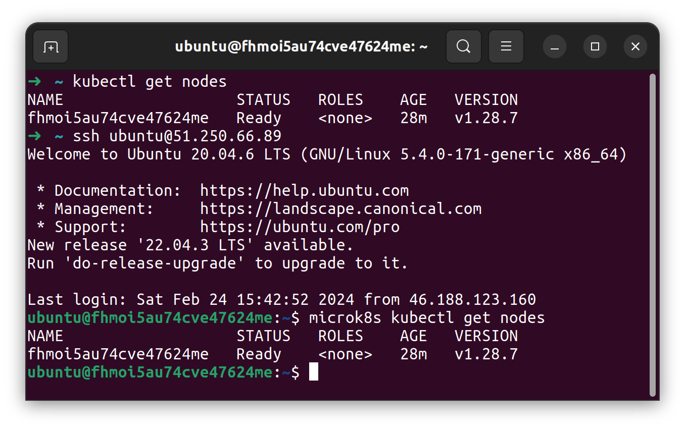
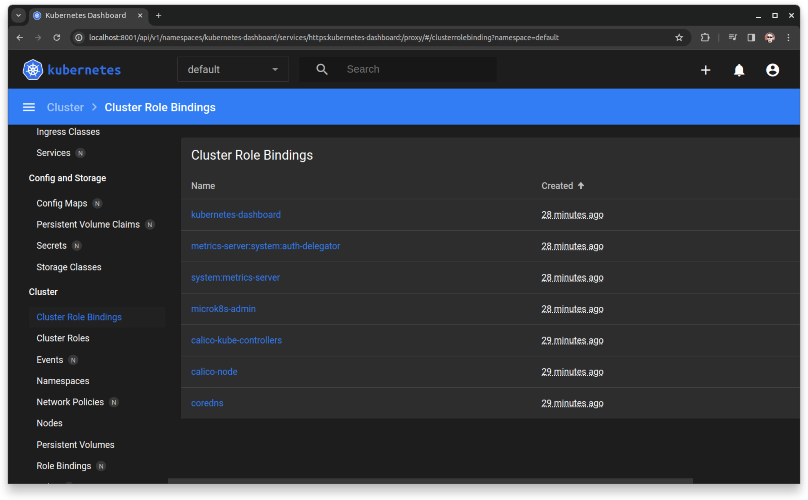

### Задание 1. Установка MicroK8S.  
Используя ~~древние манускрипты~~ собственные наработки по Terraform из предыдущих модулей развернул виртуальную машину Ubuntu 20.04 в Yandex Cloud.  
Установил на нее по инструкции MicroK8S, добавил dashboard, дописал внешний IP в шаблон конфига сертификатов и обновил сертификат.  
Скриншот get nodes на локальной машине и удаленной:  
  

### Задание 2. Установка и настройка локального kubectl.  
kubectl у меня уже был установлен, использовался для работы с Google Cloud в одном из давних проектов. Оставалось только обновить, очистить конфиг и добавить новый.  
Подключиться к дашборду с помощью port-forward сначала не получилось, сервер не отвечал на порту 10443.  
Нашел мануал как это сделать через kubectl proxy. Развернул новый сервис в отдельном неймспейсе, успешно подключился, вот пруф:  
  
Дополнительно потраченные минуты гугления помогли добавить параметр --address 0.0.0.0 к команде port-forward и всё завелось без прокси по внешнему адресу:  
  
