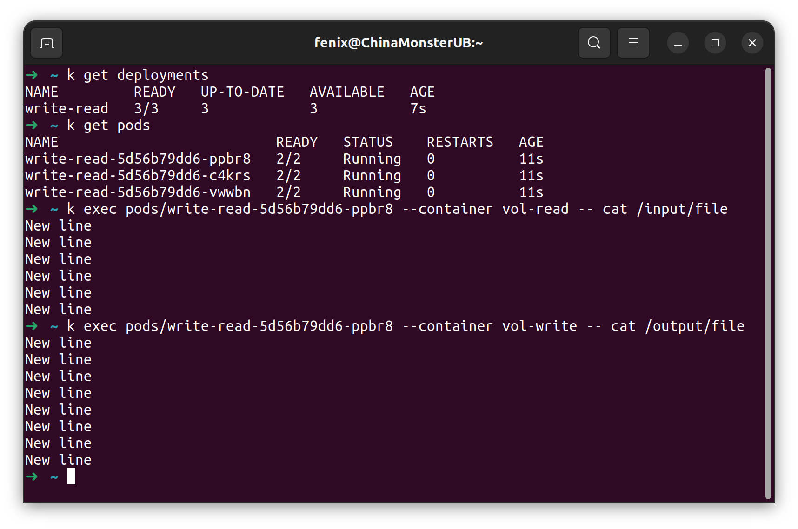
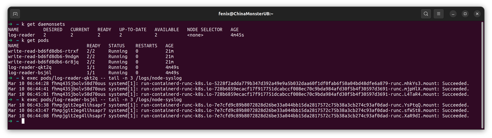

### Задание 1. Создать Deployment приложения, состоящего из двух контейнеров и обменивающихся данными.  
1. Создан Deployment приложения [write-read](deployments/write-read.yaml) из контейнеров busybox и multitool.  
2. Каждые 5 секунд busybox пишет новую строку в файл на хосте /var/k8s-data/file смонтированный в /output/file (в коммите цикл будет постоянно перезаписывать первую строку чтоб файл не рос до бесконечности).  
3. Multitool может читать тот же файл смонтированный по другому пути /input/file  
  

### Задание 2. Создать DaemonSet приложения, которое может прочитать логи ноды.  
1. Создан DaemonSet [logs-reader](daemonset/logs-reader.yaml) из приложения multitool.  
2. Доступ предоставлен только к файлу (не всей папке) /var/log/syslog, ограничен только чтением, смонтирован в подах как /logs/node-syslog.  
3. Файлы (сделал кластер из двух нод) читаются изнутри подов, содержимое отличается:  

