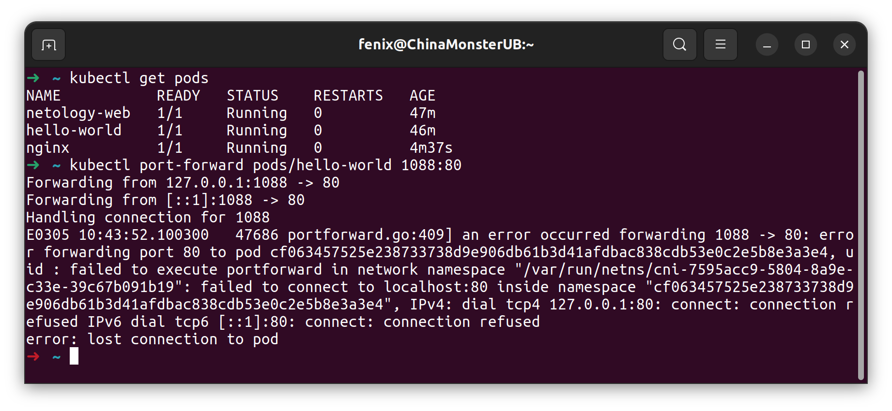
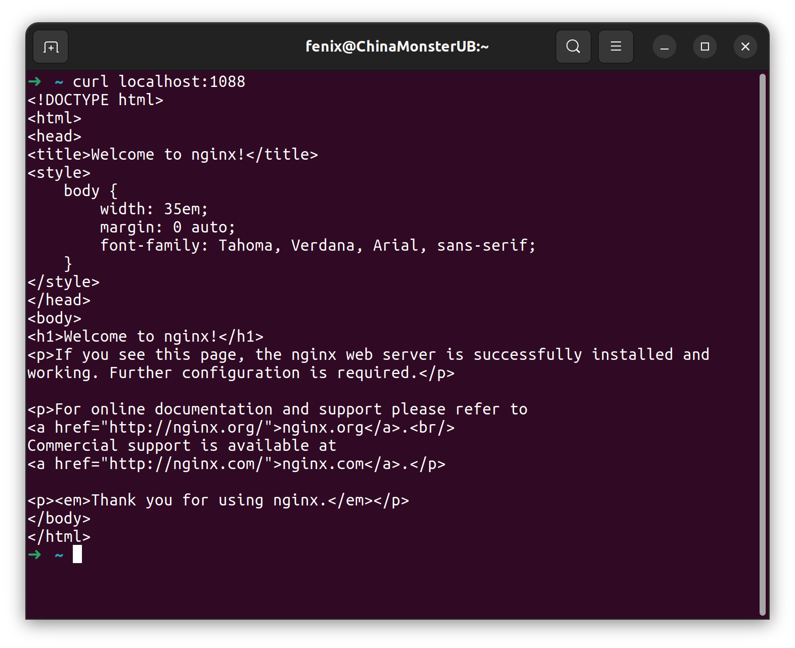
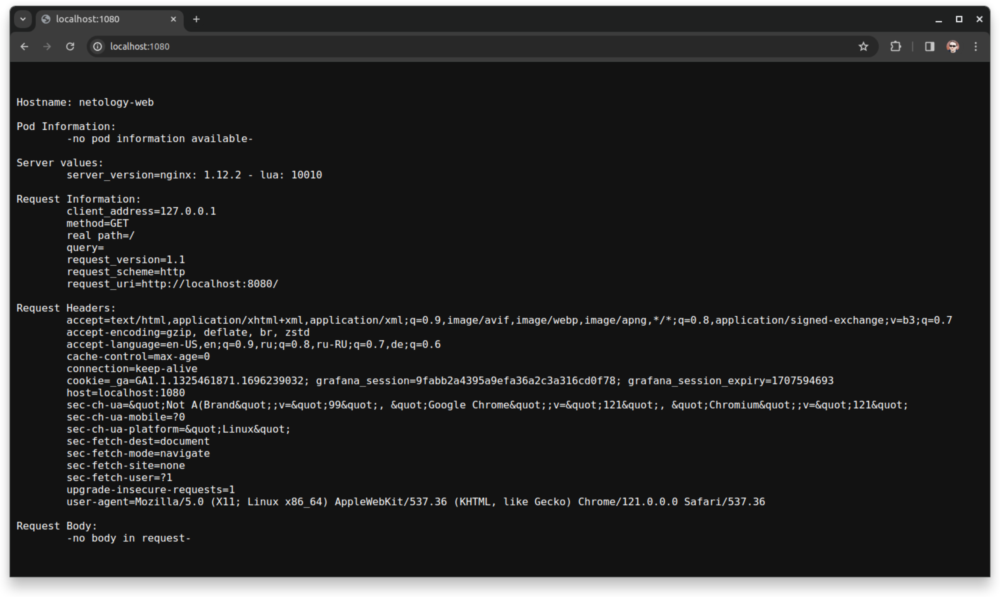

### Задание 1. Создать Pod с именем hello-world.  
Создан согласно условиям задачи, вот [манифест](pods/hello-world.yaml)  
Подключиться локально к поду с этим образом используя port-forward мне не удалось.  
  
Применил манифест через kubectl apply, проверил что под стартовал, изучил его со всех сторон, проделал те же манипуляции со вторым подом, который netology-web, но каждый раз при подключении именно к поду, не сервису получаю одну и ту же ошибку. Проверил на поде из примера (nginx), ошибки не получил. Полагаю что что-то не так с образом, дальше тратить время на него не вижу смысла.  
Вот подключение через port-forward и curl к nginx:  
  

### Задание 2. Создать сервис и подключить его к Pod.  
Не сразу понял что можно использовать тот же манифест пода, создал [новый](pods/netology-web.yaml) изменив имя и добавив в него раздел labels.  
Создал [сервис](services/netology-svc.yaml), тут через port-forward всё взлетело с первого раза.  
  
