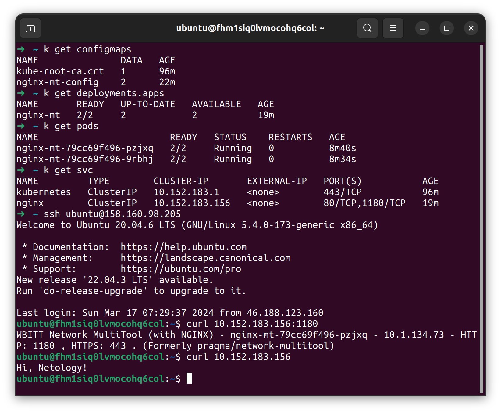
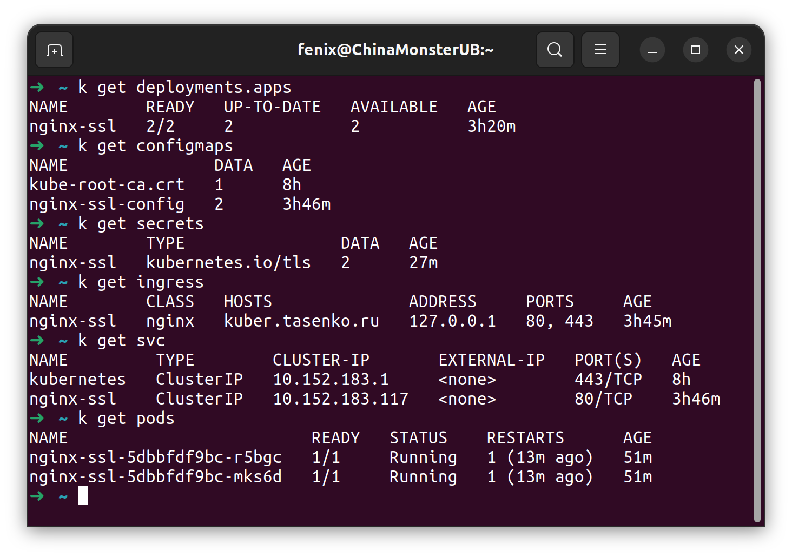
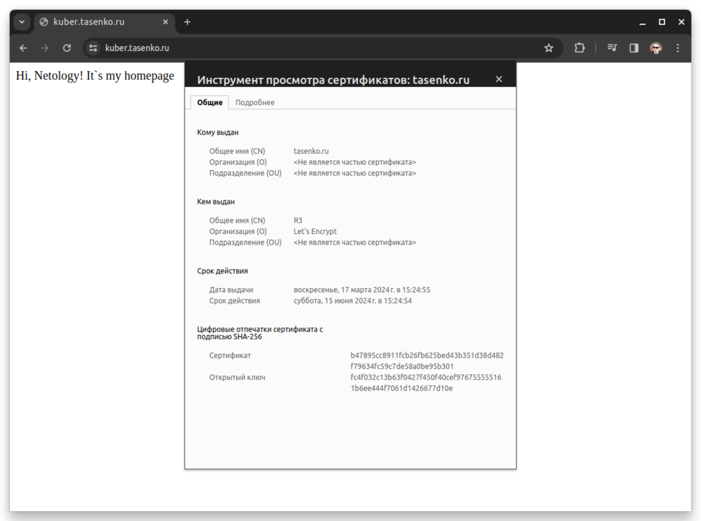

### Задание 1. Создать Deployment приложения и решить возникшую проблему с помощью ConfigMap. Добавить веб-страницу.  
1. Создан Deployment приложения [nginx-mt](deployments/nginx-mt.yaml) из контейнеров nginx и multitool.  
2. Создан ConfigMap [nginx-mt-config](configmaps/nginx-mt.yaml) содержащий два ключа: порт для multitool и содержимое стартовой страницы nginx. Проблема решена использованием порта 1180.  
3. Для простоты демонстрации сразу создан и сервис [nginx-mt](services/nginx-mt.yaml). Podы стартовали, оба контейнера работают.  
4. Создана простая веб-страница (еще в configmap), подключена к nginx как /usr/share/nginx/html/index.html. Работает.  

### Задание 2. Создать приложение с вашей веб-страницей, доступной по HTTPS.  
1. Создан Deployment приложения [nginx-ssl](deployments/nginx-ssl.yaml), состоящего из Nginx.  
2. Создан ConfigMap [nginx-ssl](configmaps/nginx-ssl.yaml) содержащий простую веб-страницу.  
3. Создан Secret [nginx-ssl](secrets/nginx-ssl.yaml) (настоящее Base64 значение ключа не кладу в репозиторий, страница [kuber.tasenko.ru](https://kuber.tasenko.ru/) будет доступна до проверки домашнего задания). Вместо выпуска самоподписанного сертификата решил усложнить себе задачу и выпустить доверенный сертификат Let`sEncrypt используя [acme.sh](https://github.com/acmesh-official/acme.sh) и DNS API CloudFlare.  
4. Создан Ingress [nginx-ssl](ingress/nginx-ssl.yaml) и Service [nginx-ssl](services/nginx-ssl.yaml), подключен Secret, всё применено, работает.  
  
