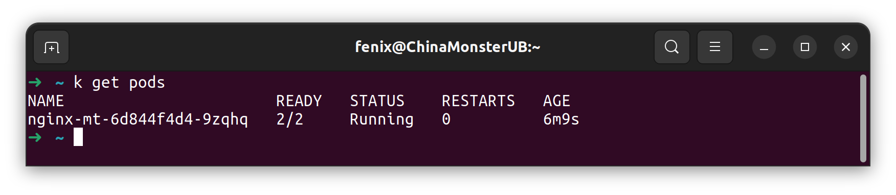
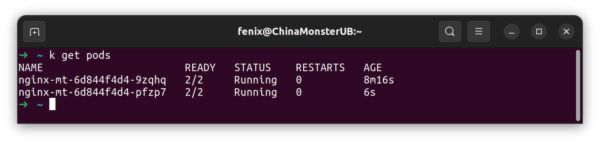
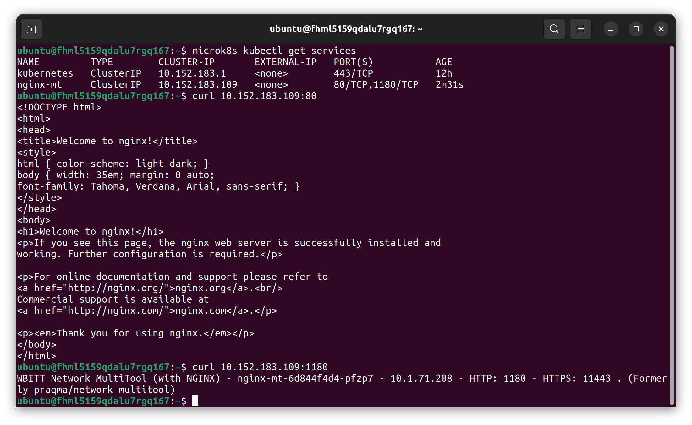
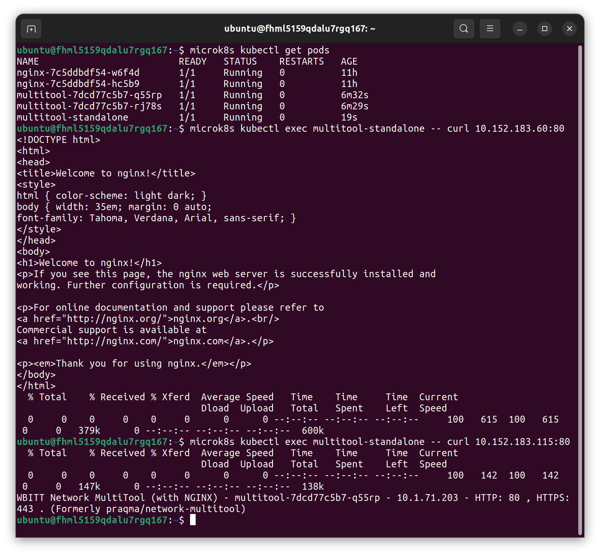
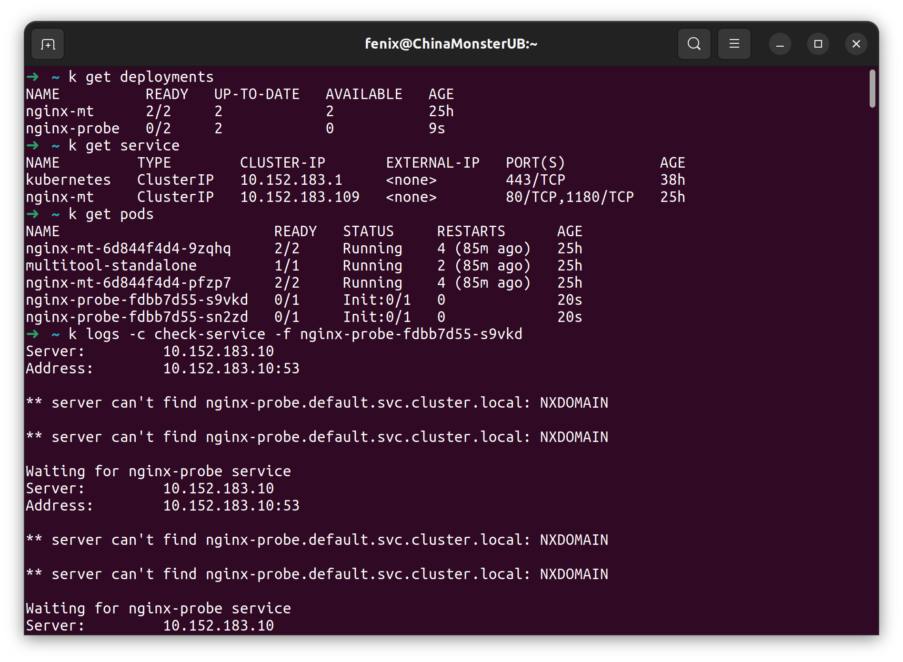
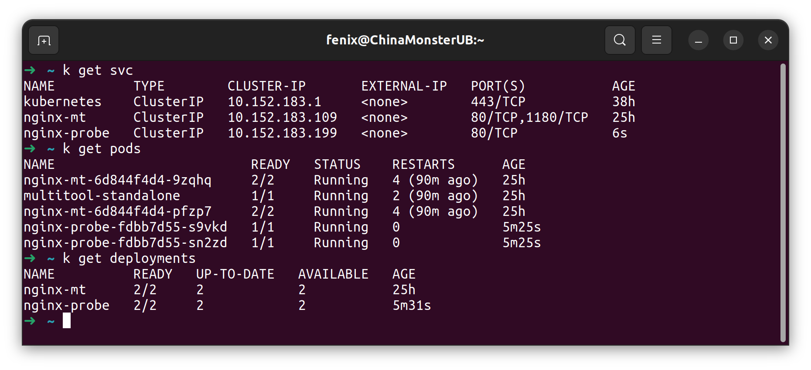

### Задание 1. Создать Deployment и обспечить доступ к репликам приложения из другого Pod.  
1. Создан Deployment приложения из двух контейнеров - [nginx-multitool](deployments/nginx-multitool.yaml).  
На выходе один под:  
  
Проблема с пересекающимися портами решена использованием версии multitool для openshift слушающей на других портах.  
2. Изменил параметр replicas на 2, выполнил k apply -f.  
  
3. Количество продемонстрировал выше.  
4. Создан сервис [nginx-mt](services/nginx-multitool.yaml)  
Доступ к репликам через сервис работает. Для упрощения процесса запускаю curl с удаленной ВМ в Yandex Cloud на локальный IP сервиса:  
  
5. Создан отдельный под с приложением [multitool-standalone](pods/multitool.yaml), при помощи curl можно связаться с ранее созданными приложениями:  
  

### Задание 2. Создать Deployment и обеспечить старт основного контейнера при выполнении условий.  
1. Создан Deployment [nginx-probe](deployments/nginx-probe.yaml) с init-контейнером ожидающим появления DNS имени сервиса.  
2. Nginx не стартует, busybox в логах выводит указанное сообщение, ждет доступности сервиса.  
  
3. [Сервис](services/nginx-probe.yaml) создан, запущен, runtime-контейнер запустился.  
  
