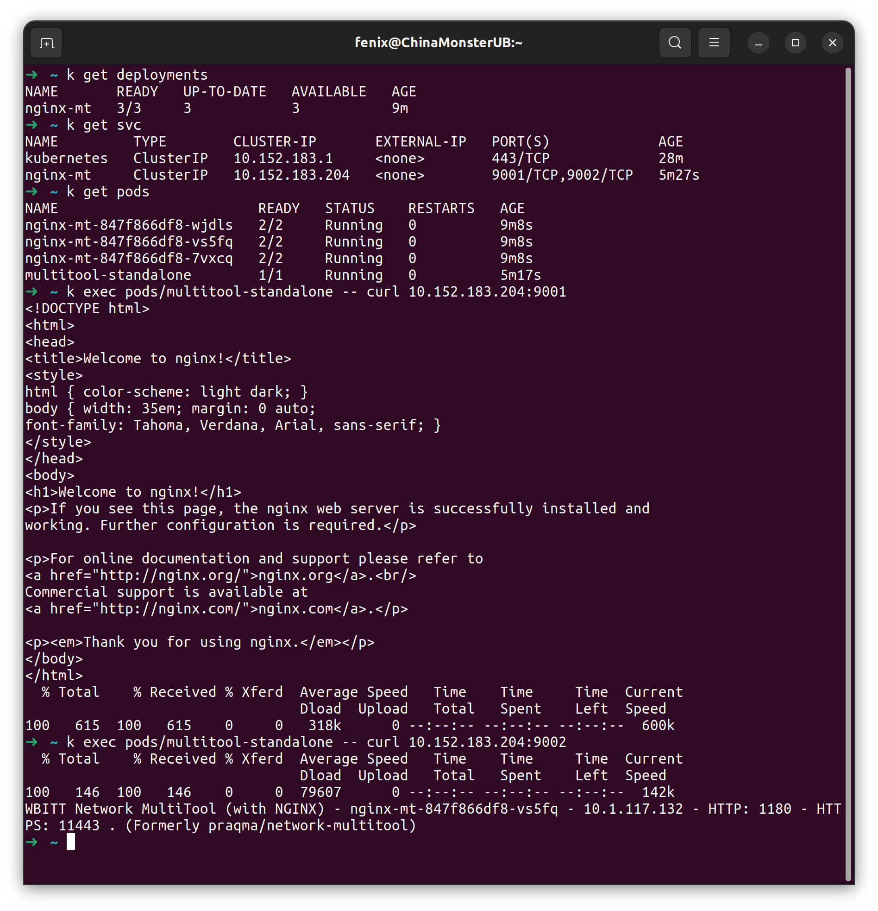
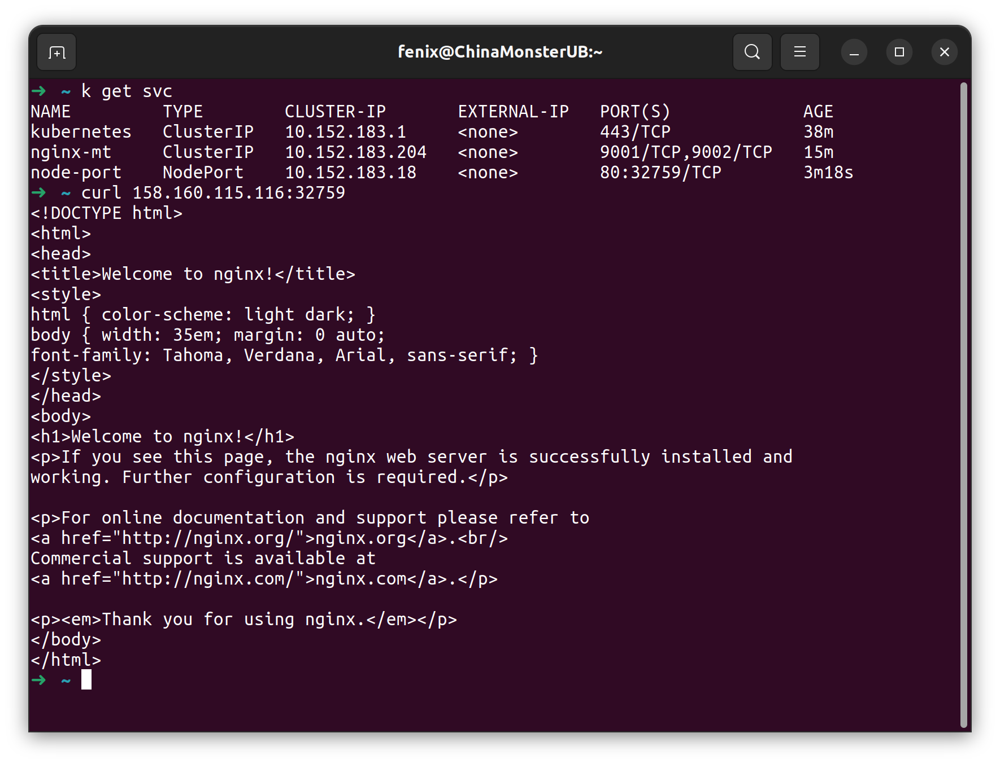
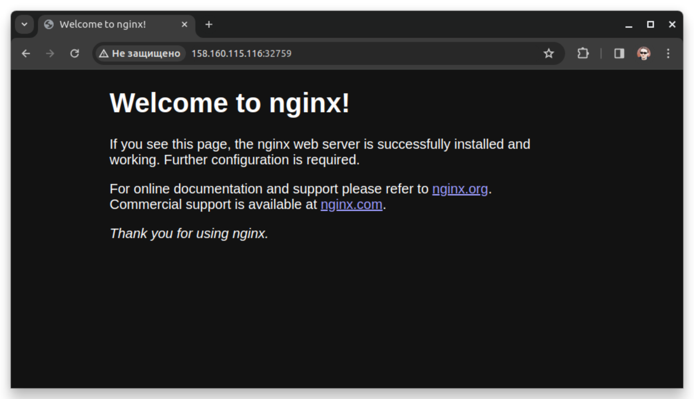

### Задание 1. Создать Deployment и обеспечить доступ к контейнерам приложения по разным портам из другого Pod внутри кластера.  
1. Создан Deployment приложения из двух контейнеров, три реплики - [nginx-multitool](deployments/nginx-multitool.yaml).  
2. Создан сервис для доступа по разным портам [nginx-mt](services/nginx-multitool.yaml)  
3. Создан отдельный под с приложением [multitool-standalone](pods/multitool.yaml)  
4. При помощи curl можно связаться с ранее созданными приложениями:  
  

### Задание 2. Создать Service и обеспечить доступ к приложениям снаружи кластера.  
1. Создан отдельный Service [node-port](services/node-port.yaml).  
2. Сервис есть, работает из консоли и браузера.  
  
  
