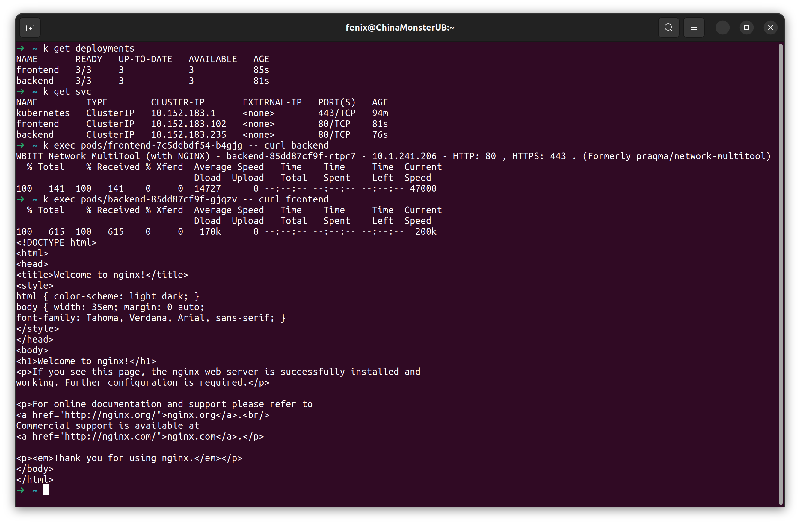
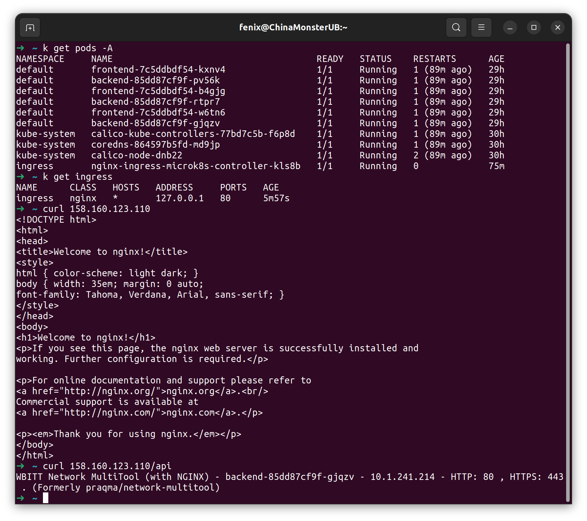

### Задание 1. Создать Deployment приложений backend и frontend.  
1. Создан Deployment приложения [frontend](deployments/frontend.yaml) из образа nginx.  
2. Создан Deployment приложения [backend](deployments/backend.yaml) из образа multitool.
3. Созданы сервисы для доступа к приложениям внутри кластера [frontend](services/frontend.yaml), [backend](services/backend.yaml).  
4. При помощи curl приложения могут связаться друг с другом в любом направлении:  
  

### Задание 2. Создать Ingress и обеспечить доступ к приложениям снаружи кластера.  
1. Контроллер в microk8s включен (microk8s enable ingress).  
2. Создан [Ingress](ingress/ingress.yaml). По-умолчанию конфигурация ingress попадала в namespace ingress к ingress-контроллеру и не могла работать с объектами в default. Дописал явно namespace в конфиг и указал его при запуске kubectl apply.  
3. Работает:  

