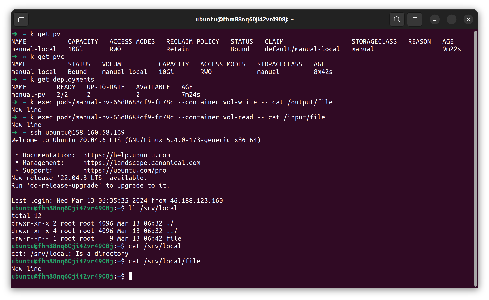
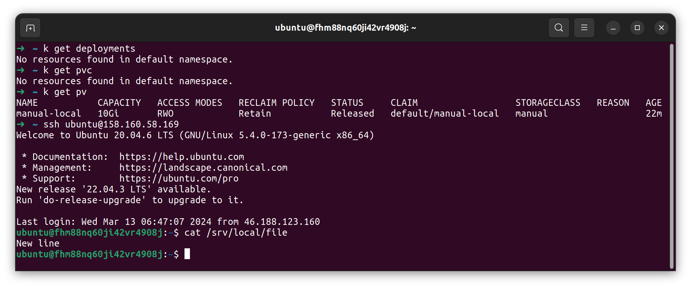
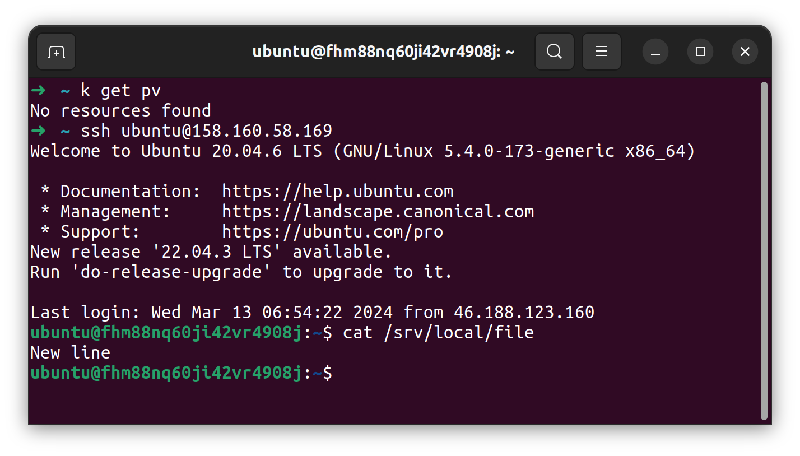
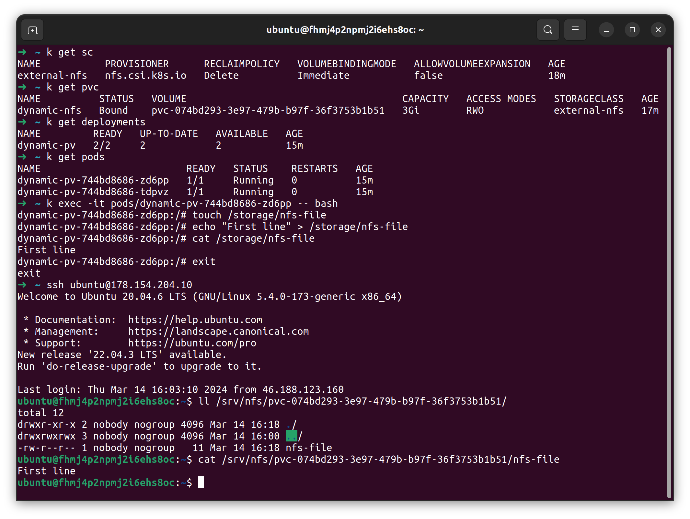

### Задание 1. Создать Deployment приложения, использующего локальный PV, созданный вручную.  
1. Создан Deployment приложения [manual-pv](deployments/manual-pv.yaml) из контейнеров busybox и multitool.  
2. Создан PV [manual-local](PVs/manual-local.yaml) и PVC [manual-local](PVCs/manual-local.yaml) для использования деплойментом.  
3. Всё применено, объекты k8s существуют, busybox может писать в файл, multitool читать, на ноде есть директория и файл.  
  
4. Удалил Deployment и PVC. PV остался жив-здоров, файл с содержимым на месте. По-умолчанию ReclaimPolicy установлена в Retain, так и должно быть.  
  
5. Удалил PV, как и предполагается для local PV файл остался на месте.  
  

### Задание 2. Создать Deployment приложения, которое может хранить файлы на NFS с динамическим созданием PV.  
1. NFS-сервер включен, настроен доступ из сети ноды к папке /srv/nfs, включен csi-driver в microk8s.  
  
2. Созданы [storageClass](storageClasses/dynamic-nfs.yaml) для динамического выделения места и [volumeClaim](PVCs/dynamic-nfs.yaml), Deployment приложения [multitool](deployments/dynamic-pv.yaml) с автоматически подключенным PV с сервера NFS.  
3. Файлы можно писать и читать из пода и на хосте.
  